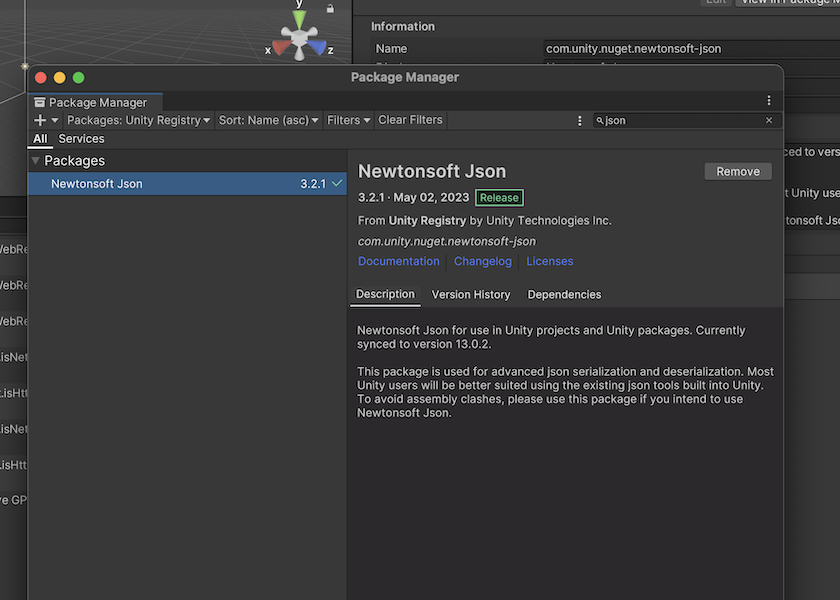

# Approov Quickstart: UnityWebRequest

This quickstart is written specifically for Android and iOS apps that are written in C# and use [`UnityWebRequest`](https://docs.unity3d.com/ScriptReference/Networking.UnityWebRequest.html) for making the API calls that you wish to protect with Approov. If this is not your situation then check if there is a more relevant quickstart guide available.

This page provides all the steps for integrating Approov into your app.

## ADDING THE APPROOV SERVICE AND BRIDGING LAYER TO YOUR PROJECT

The simplest way to add `Approov` support to your Unity project is to copy the `Assets` directory available in this repository to your `Assets` folder in your project. The `Assets` folder contains two folders: the `Plugins` folder which contains platform specific `java` and `mm` files that link with the actual `Approov` SDk binaries. For licensing purposes, we can not include the binary SDKs in this repository so instead we have included a placeholder text file for each platform: the `Android-aar.txt` and `iOS-framework.txt` files. They contain the command you have to run in order to download the actual binary SDK. Please follow the instructions and download the binary SDK in the same directory as the actual `txt` file.

Next, you need to ensure the target selection checkbox is set properly for the platform specific binaries and source files: the iOS framework and the `ApproovBridge-ObjectiveC.mm` file should be set to target only `iOS` and the Android aar library in addition to the  `ApproovUnity.java` file should target the `Android` platform. All the C# source files are either platform independent or contain conditional pre processor directives so they should be compiled for both platforms.

### ADDITIONAL DEPENDENCIES

The Approov SDK provides some of its information to the C# in JSON format and the default JSON classes available in Unity do not handle complex structures in JSON format, thus currently the Approov Service Layer makes use of `NewtonsoftJson`(https://github.com/applejag/Newtonsoft.Json-for-Unity/wiki/Install-official-via-UPM). This is available via the official Unity Package Manager .

### ANDROID SPECIFIC REQUIREMENTS

The Approov SDK for Android depends on the `okhttp` library for making networking calls so the dependency has to be specified in the gradle build file. Additionally, Approov requires internet access permission from Android and access to the networking state of the device. To enable those permissions and include `okhttp` as a dependency in the gradle files, you need to enable `Custom Main Manifest` and `Custom Launcher Gradle Template` in the `Player` and `Publishing` settings tab. 

After enabling those settings, the `AndroidManifest.xml` and the `launcherTemplate.gradle` files will appear in the `Assets/Plugins/Android` folder of your application. The following app permissions need to be available in the manifest to use Approov:

```xml
<uses-permission android:name="android.permission.ACCESS_NETWORK_STATE" />
<uses-permission android:name="android.permission.INTERNET" />
```

Note that the minimum SDK version you can use with the Approov package is 21 (Android 5.0). 

Please [read this](https://approov.io/docs/latest/approov-usage-documentation/#targeting-android-11-and-above) section of the reference documentation if targeting Android 11 (API level 30) or above.

Now edit the `launcherTemplate.gradle` file and add the `okhttp` dependency line to the `dependencies` section at the top of the file so you will end up with something like this:

```gradle
dependencies {
    implementation project(':unityLibrary')
    implementation 'com.squareup.okhttp3:okhttp:4.12.0'
    }
```

Additional Player settings required to run the Unity Android integration are shown in the image below and they specify the `Scripting Backend` and `Api Compatibility Level`. 

### IOS SPECIFIC REQUIREMENTS

There are no specific requirements regarding Approov in Unity. The only issue currently existing is the inability to include the `.xcframework` in the project and target both iOS simulators alongside a device target. To solve the issue, it is possible to download the device framework only from Approov as described in the `iOS-framework.txt` file or alternatively, download the xcframework and copy the device portion to the designated directory in your project (Assets/Plugins/iOS/).

## INITIALIZING APPROOV SERVICE

In order to use the `ApproovService` you must initialize it when your app is created, usually in the `Start` method:

```C#
using Approov;
....

ApproovService.Initialize("<enter-your-config-string-here>");

.....
```

The `<enter-your-config-string-here>` is a custom string that configures your Approov account access. This will have been provided in your Approov onboarding email.

## USING THE APPROOV WEB REQUEST

After initializing the ApproovService, you can make web requests using the `ApproovWebRequest` class which includes the `ApproovService` support. 

```C#
ApproovWebRequest www = ApproovWebRequest.Get("https://approov.io");
```

This obtains an Approov backed request object that includes an interceptor that protects channel integrity (with either pinning or managed trust roots). The interceptor may also add `Approov-Token` or substitute app secret values, depending upon your integration choices. You should thus use this client for all API calls you may wish to protect.

You **must** always call this method whenever you want to make a request to ensure that you are using the most up to date client. *Failure to do this will mean that the app is not able to dynamically change its pins.*

## CHECKING IT WORKS

Initially you won't have set which API domains to protect, so the `ApproovWebRequest` will not add anything. It will have called Approov though and made contact with the Approov cloud service. You will see debug level logging from Approov saying `UNKNOWN_URL`.

Your Approov onboarding email should contain a link allowing you to access [Live Metrics Graphs](https://approov.io/docs/latest/approov-usage-documentation/#metrics-graphs). After you've run your app with Approov integration you should be able to see the results in the live metrics within a minute or so. At this stage you could even release your app to get details of your app population and the attributes of the devices they are running upon.

## NEXT STEPS
To actually protect your APIs and/or secrets there are some further steps. Approov provides two different options for protection:

* [API PROTECTION](https://github.com/approov/quickstart-unity-web-request/blob/master/API-PROTECTION.md): You can use this if you control the backend API(s) being protected and are able to modify them to ensure that a valid Approov token is being passed by the app. An [Approov Token](https://approov.io/docs/latest/approov-usage-documentation/#approov-tokens) is short lived crytographically signed JWT proving the authenticity of the call.

* [SECRETS PROTECTION](https://github.com/approov/quickstart-unity-web-request/blob/master/SECRETS-PROTECTION.md): This allows app secrets, including API keys for 3rd party services, to be protected so that they no longer need to be included in the released app code. These secrets are only made available to valid apps at runtime.

Note that it is possible to use both approaches side-by-side in the same app.

See [REFERENCE](https://github.com/approov/quickstart-unity-web-request/blob/master/REFERENCE.md) for a complete list of all of the `ApproovService` methods.